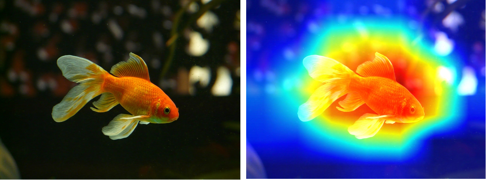
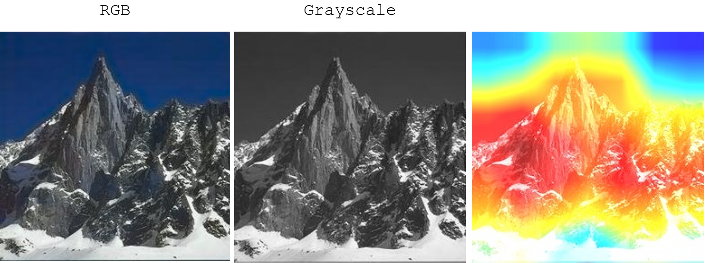

# Class Activation Map
Have you ever wondered what a Convolutional Neural Network (CNN) considered while making predictions?  
You can visualize it with class activation map. A heatmap of *'Class Activation'* is generated over the input image to look for specific features, features that may eventually influence the final prediction of the model.

 
 

# Setting
* Model used: MobileNetV2
* Platform: Colab
* Language: Python

 
 

# Warm-up
Let's take an image of goldfish and see how it works  
 

 
 

# How about outdoor scene image? 
Both RGB (3 channels) & grayscale (1 channel) work fine  
 

 
 

# How about indoor scene image?
Surprise ✨

 
 

# Key Takeaway
* If you plan to use your own pre-trained model / pre-trained weights for this example. It just doesn't work
* It works with ImageNet weights only and expects 1000 target classes (which I've placed a short comment in the code)
* For more information, kindly check out the documentation for `decode_predictions`

 
 
